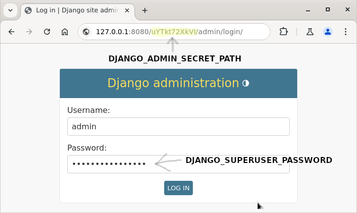

# CryptoCashier

CryptoCashier is a minimalistic, self-hosted and open-source cryptocurrency gateway payment processor. It allows you to accept payments in a secure manner without the need for private keys, using scan sites API for transaction confirmations. Payments are accepted directly to your existing crypto wallets.

## Features

- Supports most popular cryptocurrencies: USDT, USDC, ETH on Ethereum chain; USDT, USDC, TRX on Tron chain.
- Works with your existing wallets; no need to manage private keys, just add your raw addresses in admin panel.
- Automatically generates new addresses if existing ones are busy. These generated addresses can be imported into wallets like Metamask or Tronlink.
- Securely dump and delete private keys of generated addresses from the database.
- Admin panel for managing merchants, payment methods, addresses, invoices
- Easy deploy with docker: just start services and expose to public

## Getting Started

### Prerequisites

- This project is built and tested on Debian 12, but you can use any other Linux distribution.
- Docker and Docker Compose installed on your system.
- Basic knowledge of Linux bash.

### Installation

1. Clone the repository:
```bash
git clone https://github.com/simple-roll/crypto-cashier.git
cd crypto-cashier
```

2. Generate environment variables:
```bash
./generate_dotenv.sh
```

**Important:** Copy and store the generated `DB_FIELD_ENCRYPTION_KEY` securely. Losing this key may result in the loss of your funds if you didn't dump your keys.

3. Configure your `.env` file with necessary details:
- `DB_FIELD_ENCRYPTION_KEY`: copy this generated key and store it in a safe place.
- `DJANGO_SUPERUSER_PASSWORD`: store admin access password
- `DJANGO_ADMIN_SECRET_PATH`: store the secret URL path to the admin panel
- `ETHERSCAN_API_KEY` and `TRONSCAN_API_KEY`: Optional API keys for scan sites to increase API request limits. Recommended, but not required.
- `TIME_ZONE`: set same timezone with your shops or services.  List of all timezones can find [here](https://gist.github.com/mjrulesamrat/0c1f7de951d3c508fb3a20b4b0b33a98). Recommended but not required.
- `NGINX_PORT` and `GUNICORN_PORT`: ensure these port numbers are not busy on your system. Change to any other free ports if not

4. Build and start the services:
```bash
docker compose up --build
```

### Creating First Merchant

1. Go to admin panel using generated `DJANGO_ADMIN_SECRET_PATH` in URL. Use your saved `DJANGO_SUPERUSER_PASSWORD` for login. You can find everything in the `.env` file.

```browser
127.0.0.1/{DJANGO_ADMIN_SECRET_PATH}/admin
```



2. Create your first `Merchant` for your shop or service. Set the `callback_url` to receive payment results on your service. You can just set `localhost` for first try test. 


After it created copy its merchant uuid. 


### Accepting Addresses
Add your own cryptocurrency addresses or leave the `Address` list blank, and the merchant will generate new ones as needed. One address can be used by several `Merchant`s. 


**Important:** If you add your own addresses, please refrain from accepting payments to them manually, as this can conflict with customer payments and cause errors.

### Creating First Invoice 
Let's simulate a payment for a VPN service using Ethereum.

1. Replace YOUR_MERCHANT_UUID with your created merchant uuid, copy and paste URL to browser
```
127.0.0.1/create_invoice/?merchant_uuid=YOUR_MERCHANT_UUID&order_id=1&product_name=VPN&chain_name=ETHEREUM&coin_name=ETH&amount=0.05
```

This URL contains the following parameters:

- `merchant_uuid`: Merchant UUID 
- `order_id`: may contains letters, digits and other urlsafe chars.
- `product_name`: name of the product that customer pay for.
- `chain_name`: may contains `ETHEREUM` or `TRON`.
- `coin_name`: may contains `USDT`, `USDC`, `ETH`, `TRX`.
- `amount`: coin amount for pay

2. By this URL you can open creating `Invoice` page with auto filled hidden form and everything is need just check payment details and push `Pay`. 


3. Will open `Invoice` page and start background transactions checking job until they will be confirmed or `Invoice` expired.


### Invoice Underpaid and Overpaid Cases
The merchant supports multiple transactions for a single `Invoice`, and the service calculates the sum and sets one of three confirmed statuses:

- `Confirmed`: Invoice amount paid extactly as set. Payment successful.
- `Overpaid and confirmed`: Invoice amount overpaid and confirmed. Payment successful.
- `Underpaid and confirmed`: Invoice amount underpaid but confirmed. Payment failed.

Overpaid and underpaid info sending with callback requests to your shop/service.

### Extracting Private Keys and Mnemonic
After the service generates a new `Address`, you should extract its private key and mnemonic phrase using bash. Before execute these commands, ensure the project is currently running.

1. Come to running project dir
```bash
cd path/to/crypto-cashier
```

2. Dump all private keys and mnemonic phrases
```bash
./manage.sh dump_private_keys
```

3. Copy all output JSON data and save it in a safe place. Also you can use it to import into your wallet, such as Metamask or Tronlink.

4. Ensure you have saved all the dump command output from the previous step. Delete all private keys and mnemonic phrases from merchant service database using this command
```
./manage.sh delete_private_keys
```

5. After deletion these addresses can still accept payments but do it in the total safe way.

### API Rate Limits
[Etherscan](https://docs.etherscan.io/) and [Tronscan](https://docs.tronscan.org/) APIs have low rate limits without API key. For stable operation, set API keys in your `.env` file if you expect to process more than 10 invoices per day. Just make free accounts of these scansites, get API keys from accounts settings and set to `.env` params `ETHERSCAN_API_KEY` and `TRONSCAN_API_KEY`.

### Handle Merchant Notification Callbacks
`Merchant` sends notifiction callback in any case: successful and failed payments. Here are the POST request parameters sent to `Merchant.callback_url` after an invoice is confirmed or in case of failure:
- `is_payment_successful`: `true` when `Invoice` payment confirmed or overpaid, and `false` in any other case.
- `merchant_uuid`: your created `Merchant` UUID in the Cashier admin.
- `order_id`: shop/service order id, supports letters, digits, etc.
- `order_amount`: amount that customer should pay.
- `amount_confirmed`: how much customer has paid in fact.
- `amount_overpaid`: how much customer overpaid. 
- `amount_underpaid`: how much customer underpaid.
- `payment_status`: `CONFIRMED`, `OVERPAID_CONFIRMED`, `UNDERPAID_CONFIRMED`, `CANCELED`, or `EXPIRED`.
- `coin_name`: `USDT`, `USDC`, `ETH`, or `TRX`.
- `chain_name`: `ETHEREUM` or `TRON`.
- `chain_txids`: list of `Invoice` transactions txids.
- `sign`: callback request sign to filter some fake requests from attackers.

Checking the `sign` of the callback request is important because anyone can send a POST request to your shop/service claiming a successful payment. To prevent this, you must verify the request's sign using `Merchant.sign_key`. Copy this auto generated key from admin `Merchant` page and use for checking callback request. Here is Python example below

```python
import json
import hashlib

MERCHANT_SIGN_KEY = "paste key here"


def check_sign(request):
    params = json.loads(request.POST)
    sum_source = ":".join([
        MERCHANT_SIGN_KEY,
        str(params['merchant_uuid']),
        str(params['chain_name']),
        str(params['coin_name']),
        str(params["order_amount"]),
    ]).encode()
    md5 = hashlib.md5(sum_source).hexdigest()
    if md5 == p['sign']:
        print("Sign correct")
    else:
        raise ValueError("Sign incorrect")
```

You need to build a source string containing the parameters `sign_key`, `merchant_uuid`, `chain_name`, `coin_name`, and `order_amount`, separated by `:`, and calculate the `md5` sum. Then compare with `sign` param in callback request it must be same.

## Contributors
I welcome everyone who understands this project and has good ideas. Your contributions are valuable to us. Feel free to fork the repository, make improvements, and submit pull requests.

## Setup Help
If you need assistance setting up this project for your service, please contact me at: goplua@proton.me. I am happy to help but not for free.

## Donations
If you like this job please support me and I will make more nice stuff like this, here are my donation addresses:

- Ethereum (or any EVM): 0x965311B06Ff6DD813804280220BD33f19a586407
- Tron: TBEsCFe3dCrJGoJYseVVHsBCN85YJxXVDN
